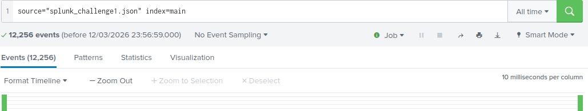
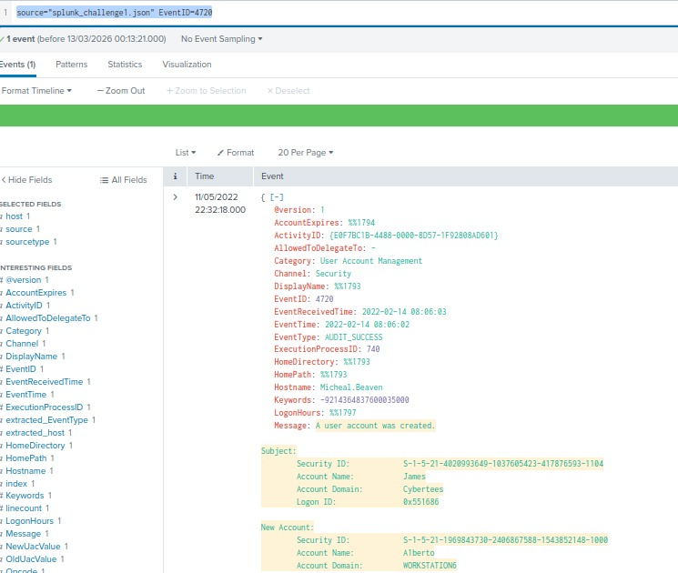
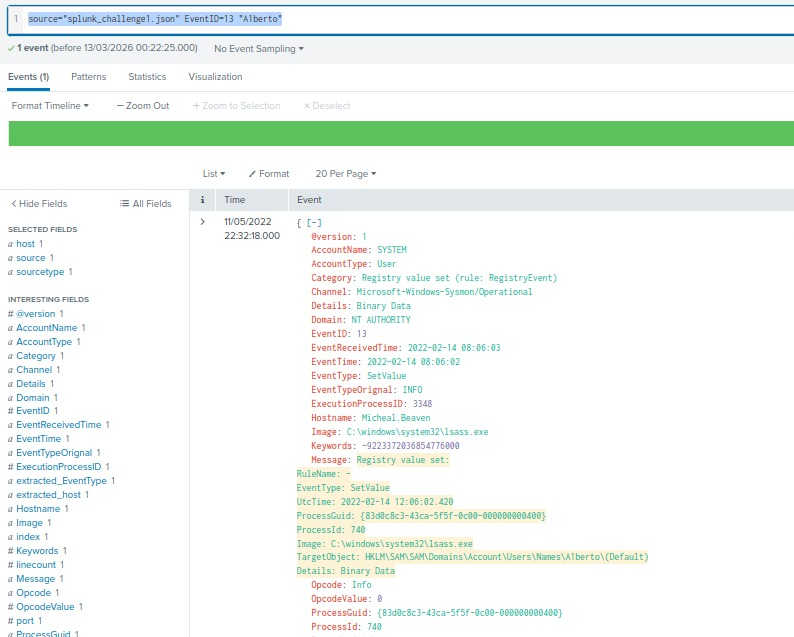
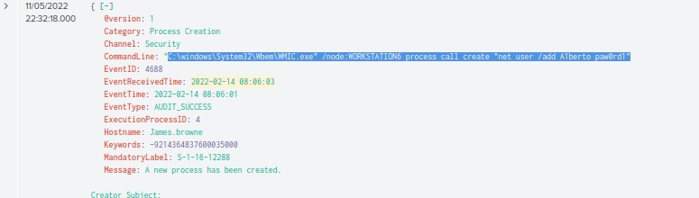
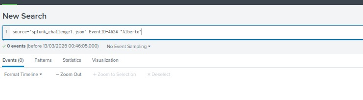
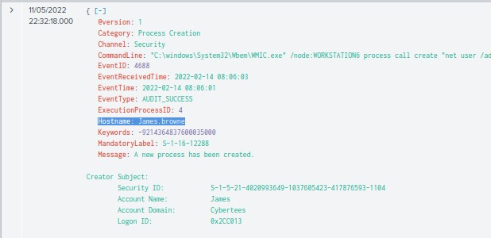
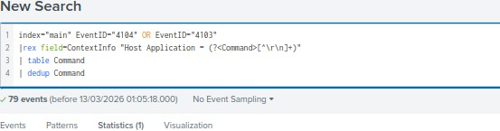
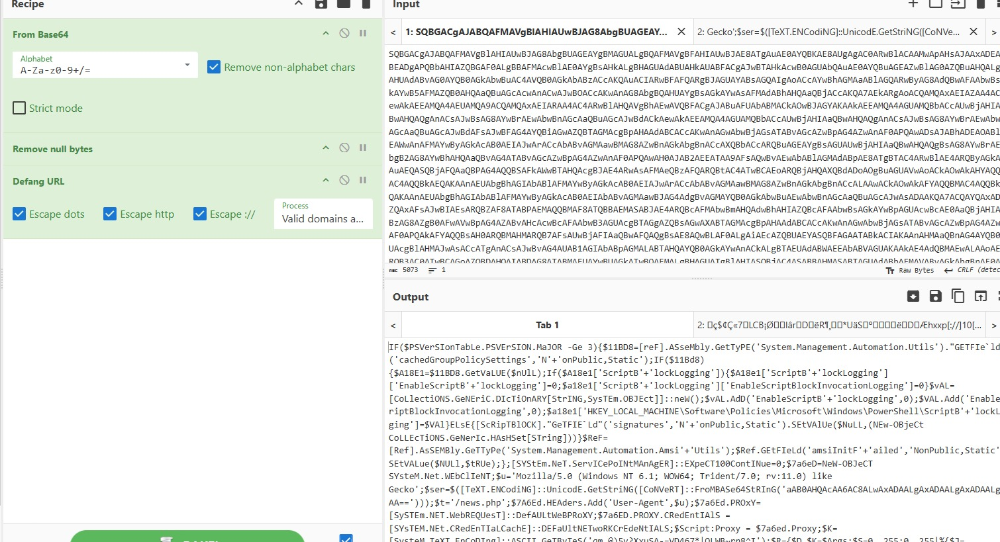
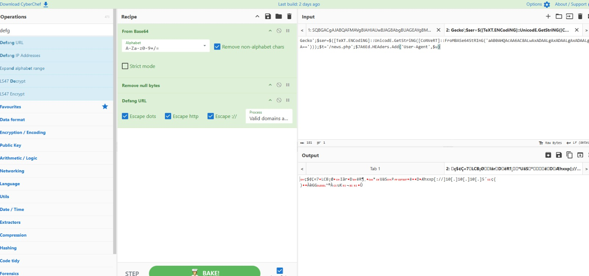

# Investigating with Splunk

## Objective

This lab focuses on investigating security events using Splunk.  
The goal is to analyze logs, perform searches, and identify suspicious activity within the dataset.

Through this investigation we practice:

- Log analysis
- Splunk Search Processing Language (SPL)
- Identifying suspicious behavior
- Event correlation

---

# Lab Environment

Tool used:

- Splunk SIEM

Main skills practiced:

- Log investigation
- Filtering events
- Querying data using SPL
- Threat detection

---

# Task 1 – Exploring the Dataset

First, we explore the available logs and understand the data structure within Splunk.

This helps identify important fields that will be useful for filtering and investigation.

---

# Task 2 – Searching Events

We perform initial searches to identify relevant logs and observe how events are structured.

This step focuses on understanding the data before narrowing the investigation.

---

# Task 3 – Filtering Events

Using filters, we begin reducing the number of results to focus on relevant activity.

This allows us to identify potential indicators of compromise or abnormal patterns.

---

# Task 4 – Deduction

This step was solved through logical deduction based on previous results, so no screenshot was required.

---

# Task 5 – Investigating Suspicious Activity

We investigate events related to potentially suspicious actions and analyze the associated fields.

---

# Task 6 – Event Correlation

At this stage, we correlate multiple events to understand the timeline of the activity.

This helps determine what actions were performed and by whom.

---

# Task 7 – Deep Investigation

We refine our search queries further to extract more specific information from the logs.

---

# Task 8 – Identifying Key Indicators

Here we identify important indicators that reveal malicious or unusual activity within the dataset.

---

# Task 9 – Confirming Findings

The investigation confirms the suspicious behavior by analyzing the relevant events in more detail.

---

# Task 10 – Final Result

Finally, we obtain the final result of the investigation and confirm the findings.

---

# Skills Practiced

- SIEM Investigation
- Log Analysis
- Splunk SPL Queries
- Security Event Investigation
- Threat Detection

